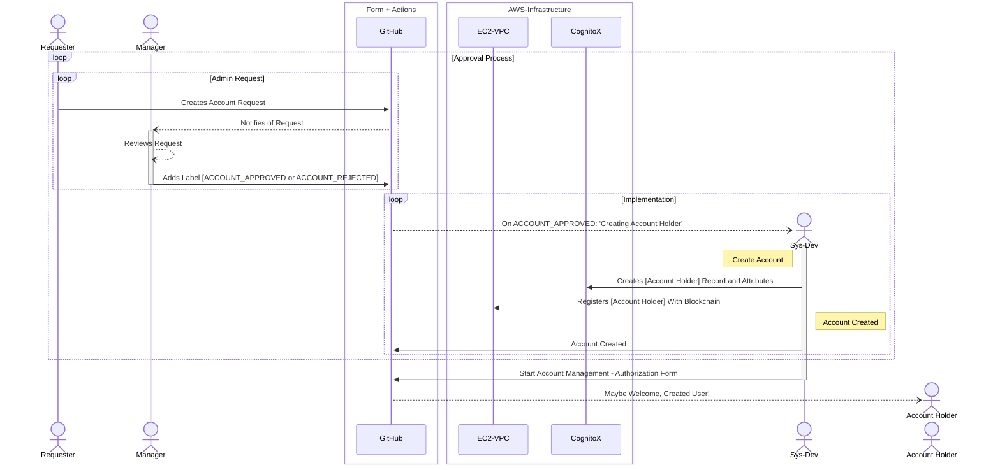

# Account Management Workflow
Document that explains the workflow of GitHub actions used to automate account management.

- The **requester** creates a new **GitHub issue** (**Account Request Form**) *to request* an account for the **Account Holder**.
- The **Blossom Management group** is automatically notified *to review* this request through GitHub.
- A **Blossom Management member** reviews the request and *adds a new label* to the issue: ACCOUNT_APPROVED or ACCOUNT_REJECTED
- If **ACCOUNT_APPROVED**, the **Blossom Sysdevs group** is automatically notified to implement the account.
- **Sys-Dev** creates account
- **Sys-Dev** submits a new issue (**Account Management - Authorization Form**) for the Account Holder.

- If **ACCOUNT_REJECTED**, the account request issue is automatically closed.

