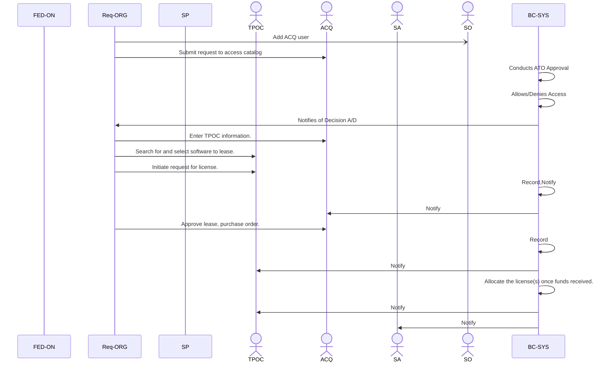

# Blossom Asset Channel

This is building on what we did for [ATO process](https://github.com/usnistgov/blossom-oscal/tree/feature-ato-process/docs/ato).

For each step:
- Note any action that should cause a transaction.
- For the transaction, what should be recorded.
- What steps occur outside of blossom vs. interacting with blossom.
- What steps should cause a notification, also note FROM to TO roles.
    - (You need a notification to let someone know to take an action to keep the process moving.)

## Organizational Terms

1. Requesting Organization (RO) - Needs license(s)
2. Service Provider (SP) - Agency that purchased the leased licenses
3. Federation (F) - All Organizations

## Actors for Organizations

1. Acquisition Officer (ACQ) - Submit and Approve
2. Technical Point of Contact (TPOC)
3. System Administrator (SA)
4. System Owner (SO)
5. Blossom System (SYS)

## Steps 
- (ORG:ROLE) Action [Transaction] [Notification]

### Considerations

- Could SO be allowed to add ACQ, TPOC for the org?

### Setting up Licenses

- (SP:SO   ) Add pools of licenses. (amounts) [*Record*]
- (SP:SO   ) Set start and end dates. [*Record*]

### Obtaining licenses

- (RO:SO|AO) Adds ACQ user. (or may add during ATO?)
- (RO:ACQ  ) Submit request to access catalog.
- (SYS     ) Allows access based on ATO approval.
- (RO:ACQ  ) Enter TPOC information. [*Record*] [*Notify:TPOC*]
- (RO:TPOC ) Search for and select software to lease.
- (RO:TPOC ) Initiate request for license. [*Record*] [*Notify:ACQ*]
- (RO:ACQ  ) Approve lease, purchase order. [*Record*] [*Notify:TPOC*]
- (SYS     ) Allocate the license(s). [*Notify:TPOC&SA*]

### Using licenses

- (RO:SA   ) Receives licenses.
- (RO:SA   ) Install application.
- (SYS     ) Primary SWID tag generated. [*Record*]
- (RO:TPOC ) Enter SWID tag. [*Record*]

### Returning licenses

- (RO:TPOC ) Return one or more allocated licenses.
- (SP:SYS  ) Marked as returned.
- (SP:SYS  ) Audit licenses.

### Lease term ends

- (SYS     ) Advise deadline to renew or release. [*Notify:TPOC&SA*]
- NORMAL COURSE (Uninstall): 
    - (SA  ) Uninstall software.
    - (SYS ) Somehow the SWID tag is removed?
    - (TPOC) Invalidate SWID tag? (Uninstalled) [*Record*]
- ALT COURSE (Extend): 
    - (TPOC) Request Extension.
    - (ACQ ) Purchase order. [*Record*]
    - (SYS ) New entry with updated license(s) expiration. [*Record*]
- ALT COURSE (Revoke): 
    - (SYS ) Revoke lease(s). [*Record*] [*Notify:TPOC*]
    - (F   ) Initiate ATO vote. (To remove from federation, in instance of bad faith)

### Obtain Licenses:

