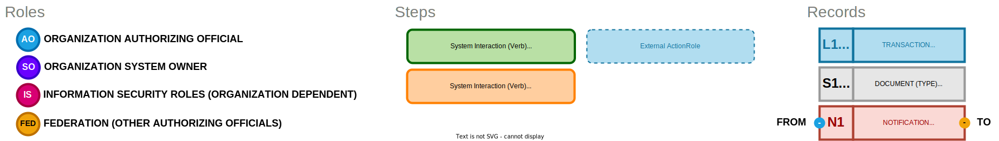
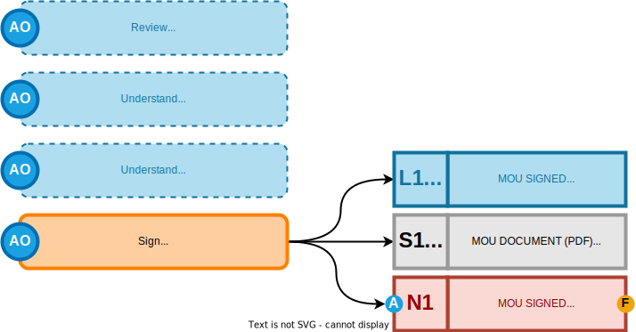
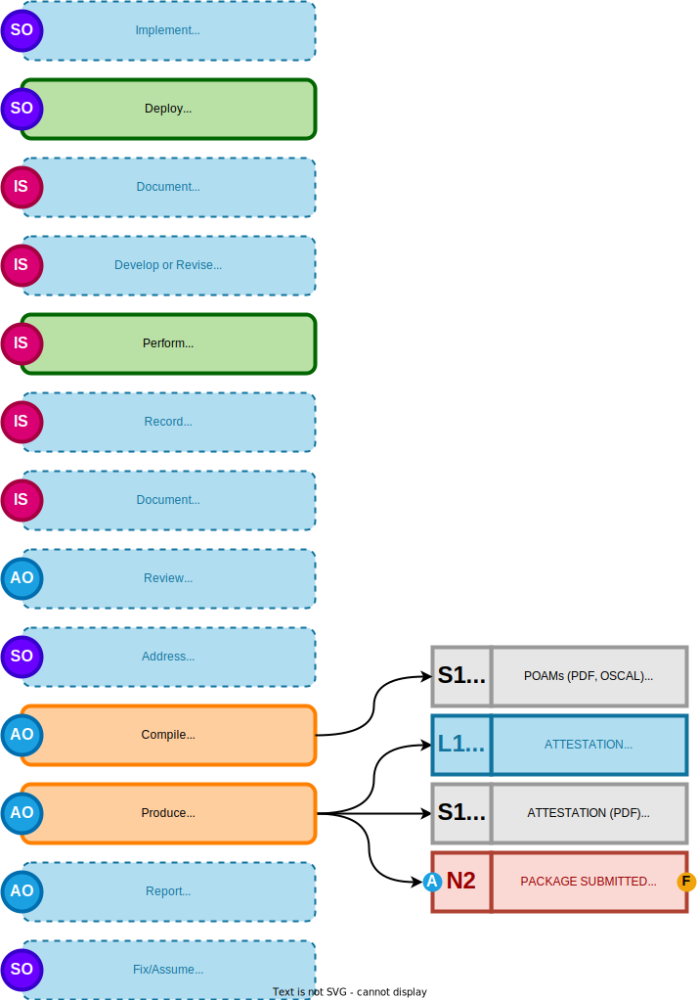

# Rough Draft of ATO Process

## Diagram Legend

>*Fig 1. Legend for the diagrams that follow.*

---

## Initiation Phase

>*Fig 2. Outline of the steps necessary to complete initiation phase.*

### Process Description

1. The first step is for the organization to obtain and review the **MOU - "Contract to Join"**, which contains:
   - *a.*) Preselected security controls that must be addressed.
   - *b.*) An outline of the assessment method, and expectations for what is produced.
2. Initiation is completed by signing the **MOU**.

---

## Implementation Phase

>*Fig 3. Outline of the steps necessary to complete initiation phase.*

### Process Description

3. The organization deploys a member node, on their own infrastructure, that will participate in the information exchange.
4. The controls for the member node are documented in an System Security Plan (SSP).
5. An assessment plan is developed to assess the controls for the implemented system.
6. An assessment is performed, and results are recorded in an assessment result.
7. Any findings from the assessment are documented in a Plan of Action and Milestone (POAM) document.
8. The organizational (local) Authorizing Official (AO) conducts a review of risk.
9.  The POAMs are addressed at AO discretion, based on risk tolerance.
10. **The AO produces a document along with unresolved POAMs (Attestation/ATO memo)** that serves as Authority to Operate.
11.  Implmentation, as a phase, is completed upon producing an Attestation and related POAMs.

---

## Authorization Phase

>*Fig 4. Outline of the steps necessary to complete initiation phase.*

### Process Description

12. **Any unresolved POAMs are reported to the federation, along with the AO attestation.** 
13. This process of fix or assume risk may be repeated as necessary to address outstanding POAMs in order to meet promised milestones.
14. The ATO document and POAMs will be reviewed by all federation members.
15. This will include a critical controls evaluation/review.
16. **Feedback by all parties in the federation will be shared, and any conditions for joining the federation will be discussed** 
17. **The federation will vote in or out on the new organizational member.**
18. Access to POAMS/ATO docs by organization.
19. **The last step allows the new organizational member to communicate commitment to join the federation.**
20. At this point, the new member is able to participate in the information exchange (in this case, license acquisition).
21. **Monitor for changes on an ongoing basis** 
22. **Record system changes.**
23. Reassess. Go to #5 (or #4 if the plan requires adjustment.)
24. Reauthorize the members.