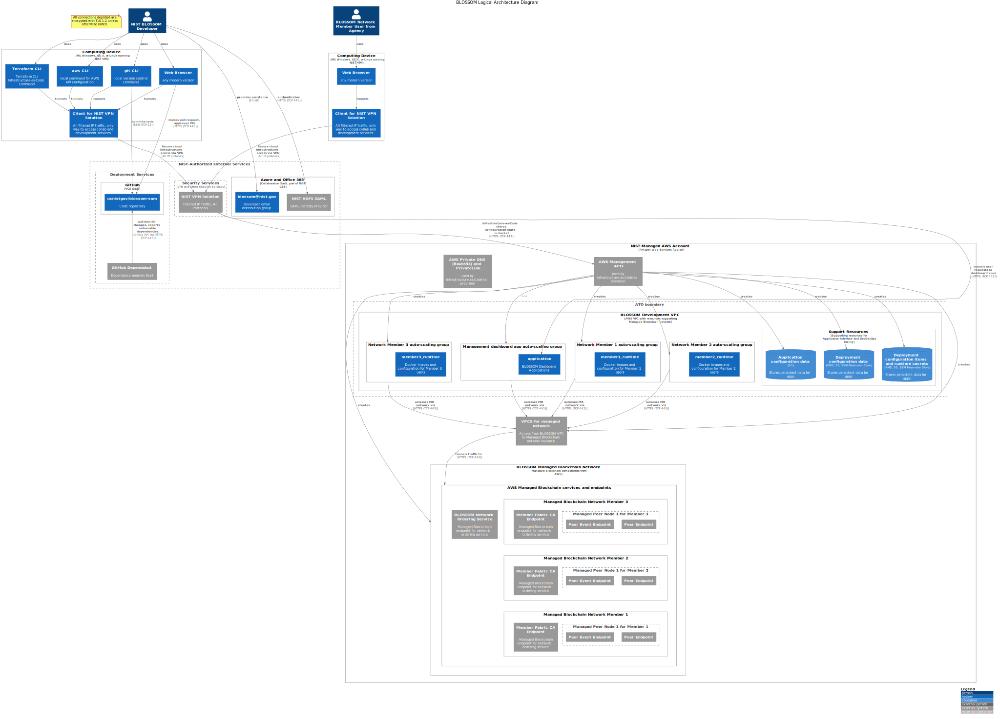

# Threat Model for BLOSSOM

This is the working draft of a threat model for the BLOSSOM infrastructure and application. The NIST BLOSSOM development maintain this draft and adapt it as project development evolves.

**NOTE:** The order of the headings is not chronological. The organization of this document with threats and attack trees first is intentionally for the benefit of the NIST developer team. It allows ease of access and focus on the current threats and scenarios.

## Threats

We use the [STRIDE Model](https://docs.microsoft.com/en-us/azure/security/develop/threat-modeling-tool-threats) for qualitatively analyzing the properties of a given threat and the [DREAD Model](https://docs.microsoft.com/en-us/previous-versions/msp-n-p/ff648644(v=pandp.10)?redirectedfrom=MSDN#dread) for quantitatively scoring the impact of a threat on a scale of 5-15.

| ID  | S | T | R | I | D | E | D | R | E | A | D | Risk Rating | Description                    | Notes                        |
|-----|---|---|---|---|---|---|---|---|---|---|---|-------------|--------------------------------|------------------------------|
| T01 | + | - | - | - | - | + | 3 | 1 | 1 | 3 | 1 | 9 (Medium)  | A NIST developer's workstation is compromised and his AWS session credentials are stolen. |  |
| T02 | + | - | - | - | - | + | 3 | 1 | 1 | 3 | 1 | 9 (Medium)  | A NIST developer's workstation is compromised and his SSH key for development server access is stolen. |  |
| T03 | - | + | - | + | - | + | 3 | 3 | 2 | 3 | 1 | 12 (High)   | NIST developers deploy updated Hyperledger Fabric code with an unknown backdoor placed in upstream code, triggering a reverse shell upon execution, with shell-level access to development servers. | |
| T04 | - | - | - | - | + | - | 1 | 1 | 1 | 2 | 1 | 6 (Low)     | A participating agency member has a user on a client node that spams the network channels and attempts to generate excessive load for peer nodes, causing a denial of service for the peer nodes |  |
| T05 | + | - | - | - | - | + | 1 | 3 | 1 | 3 | 1 | 9 (Medium)  | A disgruntled NIST or participating agency developer has access to development server with member client configurations, and determines they can use a permissive client configurations to use local admin MSP credentials and generate spurious user accounts for the member |  |
| T06 | - | + | + | - | - | + | 2 | 1 | 1 | 2 | 3 | 9 (Medium)  | A logical defect in the Golang source of the Chaincode smart contract application allows members to change the ATO status of software item for which they do not have permissions. |  |
| T07 | - | - | + | + | - | - | 3 | 3 | 2 | 1 | 1 | 10 (High)   | An input validation weakness in the dashboard applications allows a malicious user to retrieve configuration items for the applications themselves from a local file in the container with configuration secrets |  |

<!-- Below is a placeholder example template for creating new entries during a threat modeling session. -->
<!-- | T00 | - | - | - | - | - | - | 0 | 0 | 0 | 0 | 0 | 0     | This is a placeholder example. | These are placeholder notes. | -->

## Countermeasures

| ID  | Status         | Threat IDs | Description                        | Notes                        |
|-----|----------------|------------|------------------------------------|------------------------------|
| C01 | Implemented    | T01, T02   | Enforce VPN-only ingress to access the development environment | Even if an attacker exfiltrated the credentials, they are not usable outside properly configured workstations, greatly limiting possible threat agents to insider threats (with auditable activity in the network) |
| C02 | Implemented | T01,       | MFA authentication backed by ADFS SAML authentication and mandatory maximum session lengths on AWS session tokens are enforced | The federated authentication system, with use of PIV-based multi-factor authentication, and ban on AWS long-term access key makes it very difficult to establish persistence after gaining a foothold with AWS credentials |
| C03 | Partial, Research Needed | T03        | Enforce egress traffic filtering for outbound network access | NIST IT's managed network configuration for managed AWS accounts has blocked certain egress via SSH, but no authorative policy or document filtering rules are known |
| C04 | Partially Implemented | T04, T05, T06 | Cloudwatch audit logging is enabled for AWS account operations, Managed Blockchain API access, and partially for server logs |  |
| C05 | Needs Research | T05       | Fabric CLI client isolation at an logical, network, AWS IAM, and server layers | For the purposes of pilot development and efficient debugging per AWS guidance, we stored multiple client configurations on the same hosts. As the pilot stabilizes, we documented in initial threat modeling this is not secure for real-world deployment scenarios. |
| C06 | Partially Implemented | T06, T07     | Source code review by one or more developers before code is merged into the development environment. |  |
| C07 | Partially Implemented | T03  | The development team performs automated vulnerability scanning of software dependencies used in this project. | Since vulnerability management is a general and multi-dimensional term, we can expand this into individual vulnerability management processes with further threat modeling. |
| C08 | Partially Implemented, Needs Research | T06 | The NIST BLOSSOM developers use best practices in Chaincode smart contract deployment with using lifecycle policy to require majority consensus from member nodes to execute updated application code.  | These are placeholder notes. |

<!-- Below is a placeholder example template for creating new entries during a threat modeling session. -->
<!-- | C00 | Needs Research | T00,       | This is a placeholder description. | These are placeholder notes. | -->

## Attack Trees

TBD

### Analysis and Supporting Evidence

### System Overview

BLOSSOM is a proof-of-concept service that implements a software asset management solution with smart contract applications deployed within a permissioned, private blockchain. This application will facilitate a software management solution for the lease of software licenses as well as summary information about their assessment and authorization status. Additionally, the use of modern cloud architecture, deployment methodologies, and security architecture will be documented and tested via the use of OSCAL and supporting automation.

### System Decomposition

When performing risk assessment and threat modeling, we decompose the system into four major components.

1. AWS Infrastructure and Custom Infrastructure from NIST Development Team
1. Hyperledger Fabric private blockchain network
1. The BLOSSOM smart contract application
1. Web application for dashboard visualization and member user provisioning

### System Architecture and Diagrams

Below is a logical diagram of the current system architecture.

#### Data-Flow Diagrams

TBD

### Assets

The BLOSSOM service and it's sub-systems comprise a set of logical assets. We list them below.

- AWS Infrastructure and Custom Infrastructure from NIST Development Team
  - Credentials and linked authorization roles for cloud account, managed service, and server privileges
  - Source code for Infrastructure-as-Code deployment and smart contract source code
  - Documentation for system deployment and smart contract application bootstrap
  - Privileged authenticated network access to peer networks via VPC Endpoints 
- Hyperledger Fabric private blockchain network
  - Hyperledger Fabric certificate authority and public key infrastructure
  - Blockchain channels, their ledger data, and metadata accessible through Hyperledger Fabric endpoints
- BLOSSOM smart contract application
  - Agency staff metadata
  - Authorization database and the NGAC attribute-based authorization procedures
  - Software metadata and licenses
  - Agency assessment and authorization state for different software
- Web applications for visualization and user provisioning

### External Dependencies

- The managed blockchain services provided by AWS are properly designed, implemented, and maintained in a way to defend against low-effort and low-complexity attacks by determined threat agents
- The certificate authority and intermediate certificate authority managed by AWS is designed, implemented, and maintained against low-effort and low-complexity attacks
- AWS designs, implements,  and maintains at-rest and in-transit encryption secure blob storage (S3), configuration items, and secrets (SSM Parameter Store) when NIST developers configure these items according to AWS best practice recommendations
- AWS designs, implements, and maintains secure network configuration for internal network access for a private blockchain via VPC Endpoints when NIST developers configure them according to AWS best practice recommendations
- Secure authenticated and authorized access to the pilot development environment is guaranteed at the network layer by the NIST VPN solution and the proper AWS VPC network configuration from NIST IT staff
- Secure authenticated, authorized, and properly monitored access and development in the pilot environment is performed by properly vetted NIST staff
- Secure authenticated, authorized, and properly monitored access and development in the pilot environment is performed with NIST workstations
- Secure authenticated, authorized, and properly monitored access and development in the pilot environment is performed by properly vetted staff from other participating agencies
- Secure authenticated, authorized, and properly monitored access and development in the pilot environment is accessed by staff from their agency workstations that have been properly secured
- The staff that develop and maintain the open-source Hyperledger Fabric toolchain practice secure development and apply a secure software development lifecycle to prevent low-effort and low-complexity vulnerabilities
- NIST and agency developer staff prevent supply chain attacks and prevent defects in their software in part by storing source code in GitHub and configuring project repositories to follow best practice
- NIST IT has properly applied operating system hardening guidance from DISA and CIS accordingly for their pre-configured AWS AMI used for server operating systems in the development environment
- NIST IT performs regular vulnerability scanning for networked systems in the development environment to notify the BLOSSOM development team of high-risk configurations and vulnerabilities

### Ingress and Egress Points

#### Ingress

- AWS Infrastructure and Custom Infrastructure from NIST Development Team
  - Authenticated and authorized VPN access for development team to test environment
- Hyperledger Fabric private blockchain network
  - Client nodes deployed by NIST developers or other participating agencies
- The BLOSSOM smart contract application
  - Client nodes deployed for updating blockchain code operated by NIST developers and/or developers from other participating agencies
- Web applications for visualization and user provisioning

#### Egress

- AWS Infrastructure and Custom Infrastructure from NIST Development Team
  - Authenticated and authorized VPN access for development team to test environment
- Hyperledger Fabric private blockchain network
  - Client nodes deployed by NIST developers or other participating agencies
- The BLOSSOM smart contract application
  - Client nodes deployed for updating blockchain code operated by NIST developers and/or developers from other participating agencies
- Web applications for visualization and user provisioning

### Trust Levels

- TL01: NIST BlOSSOM Development Team
- TL02: Partner Agency Development Team(s)
- TL03: AWS services with authenticated and authorized IAM roles for system-to-system communication
- TL04: AWS EC2 instances with authenticated and authorized IAM roles
- TL05: Channel MSP
- TL06: Local MSP

# Appendix

## References

1. [Hyperledger Fabric Architecture Reference](https://hyperledger-fabric.readthedocs.io/en/release-2.2/architecture.html)
1. [Amazon's official documentation for AWS Managed Blockchain](https://docs.aws.amazon.com/managed-blockchain/?id=docs_gateway)
1. [Microsoft's Threat Modeling Tool's article on STRIDE](https://docs.microsoft.com/en-us/azure/security/develop/threat-modeling-tool-threats)
1. [Microsoft's Pattern and Practices Improving Web Application Security June 2003 Chapter 3 description of the DREAD model](https://docs.microsoft.com/en-us/previous-versions/msp-n-p/ff648644(v=pandp.10)?redirectedfrom=MSDN#in-this-chapter)
1. [Hyperledger Fabric penetration test sponsored by the Linux Foundation](https://wiki.hyperledger.org/download/attachments/13861997/2021%20HyperLedger%20Fabric%20Penetration%20Test%20v1.1.pdf?version=1&modificationDate=1621520080000&api=v2)